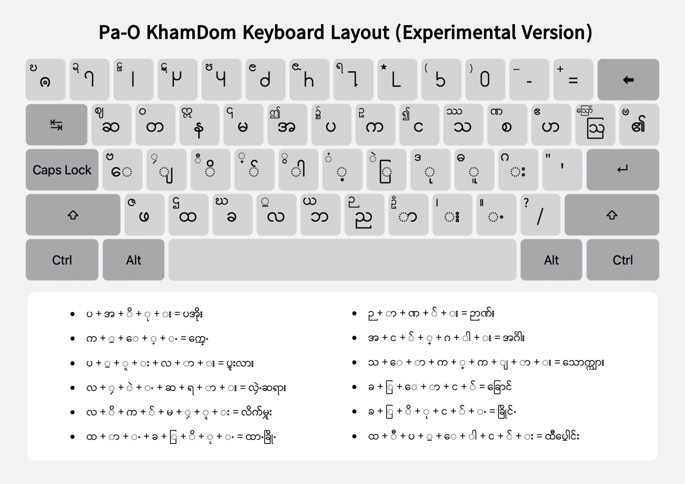

# Pa-O Kham Dom Experimental

`Pa-O Kham Dom Experimental` သည် Windows နှင့် macOS တွင် ပအိုဝ်းစာရိုက်ရန်
ပြုလုပ်ထားသော စမ်းသပ်ဆဲ Keyman ကီးဘုတ်နှင့် တွဲဖက်ဖောင့် package ဖြစ်သည်။
ကီးဘုတ်၏ အမြဲတမ်း ID သည် `pa_o_kham_dom` ဖြစ်သည်။

## ဒေါင်းလုဒ်ဆွဲရန်

[**Pa-O Kham Dom Experimental (.kmp) ကို ဒေါင်းလုဒ်လုပ်ရန်**](https://github.com/khunaungpaing/Pa-O-Kham-Dom-Experimental/releases/download/v1.0/pa_o_kham_dom_v1.0.kmp)

## Install လုပ်နည်း

1. Keyman မရှိသေးပါက [Keyman Download](https://keyman.com/en/downloads/) မှ
   သင့် Windows သို့မဟုတ် macOS အတွက် Keyman ကို download လုပ်ပြီး install လုပ်ပါ။
2. အပေါ်က [Pa-O Kham Dom Experimental (.kmp)](https://github.com/khunaungpaing/Pa-O-Kham-Dom-Experimental/releases/download/v1.0/pa_o_kham_dom_v1.0.kmp) ကို
   download လုပ်ပါ။
3. Download လုပ်ထားသော `pa_o_kham_dom-v1.0.kmp` ကို double-click လုပ်ပြီး Keyman
   package window မှ **Install** ကိုနှိပ်ပါ။
4. စာရိုက်မည့် application တွင် **Pa-O Kham Dom Experimental** keyboard ကိုရွေးပြီး
   **KhamThaton-Exp** font ကိုရွေးပြီး အသုံးပြုလို့ရပါပြီ။

## Keyboard Layout

## Unicode အခြေအနေ

ပအိုဝ်းနံပါတ်များသည် တရားဝင် Unicode code point များ ရရှိပြီးသားဖြစ်သည်။
ဤကီးဘုတ်က number row မှ `U+116D0`–`U+116D9` ကို တိုက်ရိုက်ထုတ်ပေးသည်။

တရားဝင် Unicode code point မရသေးသော Kham Dom ပုံစံ သုံးလုံးသာ ကျန်ရှိနေသေးသည်။
ယင်းသုံးလုံးအတွက် ရှိပြီးသား Unicode value များကို ယာယီအစားထိုးသုံးထားသည်။

| လိုအပ်နေသေးသော ပအိုဝ်းပုံစံ | Keyboard output | Font ပုံမှန်အသုံးပြုလျှင် | `ss01` ဖွင့်လျှင် |
| --- | --- | --- | --- |
| ထိုမ်းပါ | `U+103E` (`ှ`) | ထိုမ်းပါ | `ှ` မူရင်းပုံစံ |
| လပန် | `U+105E` (`ၞ`) | လပန် | `ၞ` မူရင်းပုံစံ |
| ခမ်းသိုမ်ဖြိုင် | `U+108F` (`ႏ`) | ခမ်းသိုမ်ဖြိုင် | `ႏ` မူရင်းပုံစံ |

ပုံမှန် ပအိုဝ်းစာရိုက်ရန် `ss01` **ဖွင့်ရန်မလိုပါ**။ KhamThaton-Exp font ကို
ပုံမှန်အသုံးပြုလျှင် အထက်ပါ ပအိုဝ်းစာလုံးပုံစံများကို မြင်ရမည်ဖြစ်သည်။
`ss01` ကိုဖွင့်လျှင် ယာယီအစားထိုးယူထားသော Unicode glyph ၏ မူရင်းပုံသဏ္ဍာန်ကို
စစ်ဆေးရန်သာ အသုံးပြုပါ။

နောင်တွင် လိုအပ်နေသော အက္ခရာသုံးလုံးအတွက် မှန်ကန်သော Unicode code point များ
ရရှိလာပါက ယခုယာယီ output များကို မှန်ကန်သော code point များသို့ ပြန်ပြောင်းပေးမည့်
converter ကို ထုတ်ပေးမည်။

## ရည်ရွယ်ချက်

ဤကီးဘုတ်နှင့်ဖောင့်ကို ပအိုဝ်းစာရိုက်ရန် အဓိကရည်ရွယ်ထားသည်။ ASCII/Win font
အဟောင်းဖြင့် စာရိုက်ရာတွင် ပါဌ်ဆင့်စာလုံးများအတွက် `Alt` နှင့်တွဲနှိပ်ရခြင်း၊
စာရိုက်ရခက်ခဲခြင်းတို့ကို လွယ်ကူစေရန် Keyman keyboard mapping နှင့် OpenType font
ဖြင့် ပြုလုပ်ထားခြင်းဖြစ်သည်။

ဤ package သည် ASCII/Win-font document အဟောင်းများကို အလိုအလျောက် Unicode သို့
ပြောင်းပေးသော converter မဟုတ်ပါ။

### `ss01` ဖြင့် မူရင်း glyph ကိုစစ်ဆေးနည်း

`ss01` ကိုဖွင့်လျှင် အထက်ဖော်ပြပါ အစားထိုး Unicode output သုံးခု၏ မူရင်း glyph
ပုံစံကိုသာ ပြမည်ဖြစ်သည်။ ပအိုဝ်းစာကို ပုံမှန်မြင်ရန် ပြန်ပိတ်ရမည်။

**Microsoft Word:** စာကို select လုပ်ပြီး `Home` tab ရှိ **Font** section ၏
dialog launcher ကိုနှိပ်ပါ၊ သို့မဟုတ် `Ctrl + D` (သို့မဟုတ်) `Cmd + D` နှိပ်ပါ။ **Advanced** tab မှ
**OpenType Features** အောက်ရှိ **Stylistic sets** ကို **Set 1** အဖြစ်ရွေးပါ။

## အခြား software များ

KhamThaton-Exp font ကို အသုံးပြုနိုင်သော software များတွင် ပုံမှန် ပအိုဝ်းစာ
ပုံသဏ္ဍာန်ကို မြင်ရမည်ဖြစ်သည်။ OpenType `ss01` ကို support ပေးသော software များတွင်
သာ အစားထိုးယူထားသော မူရင်း glyph ပုံစံကို စစ်ဆေးရန် ဖွင့်နိုင်သည်။

## Package တွင်ပါဝင်သောဖိုင်များ

- `KhamThaton-Exp Regular` (`KhamThaton-Exp-Regular-0.2.ttf`)
- `KhamThaton-Exp Bold` (`KhamThaton-Exp-Bold-0.2.ttf`)
- Pa-O Kham Dom Experimental keyboard နှင့် on-screen keyboard
- SIL Open Font License 1.1 (`OFL.txt`)

## သတိပြုရန်

ဤကီးဘုတ်သည် Standard version မဟုတ်ပါ။ Project ပိုင်ရှင်၏ ခွင့်ပြုချက်မရှိဘဲ
official Keyman catalog သို့ upload သို့မဟုတ် publish မလုပ်ပါနှင့်။
